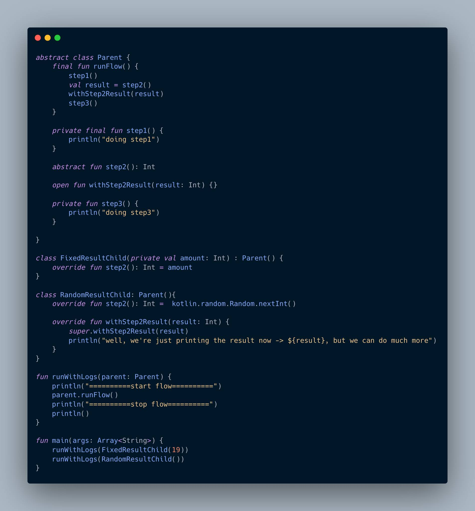

+++ 
date = 2022-09-12T20:59:47+02:00
title = "أفكار عامة عن الـ template pattern"
description = ""
slug = "thoughts-on-template-pattern"
authors = []
tags = ["thoughts", "randoms"]
categories = ["software-engineering", "design-patterns"]
externalLink = ""
series = []
+++

صديقي البروجرامر/السوفت وير إنجنير أينما كنت، ليك وحشة والله!

بقالنا كتير مشوفناش بعض، مسلمناش على بعض، يلا حصل خير. أنا لقيت نفسي قاعد أنا وصديقي[ حسن عصام](https://www.facebook.com/HassanEFahmy) بنتكلم عن الـ template pattern فقولت أقولك يمكن الكلام يعجبك..

طبعًا أنا مش هشرحلك الـ template pattern عشان أنا متأكد أنك عارفه كويس، أنا هنا عشان أقولك شوية ملاحظات سريعة أعتقدها مثيرة للاهتمام وروشة كده.

خليني أسألك: إيه المشترك ما بين الـ lifecycles في معظم الـ ui tools اللي استخدمها (سواء كانت Android, iOS , react أو حتى desktop) ؟

أرجوك متردش الرد السهل بتاع أن كلهم lifecycles، أنت عندك أحسن من كده!

والأهم: إيه علاقة ده بالـ template pattern؟

هاتلك بقي كوباية شاي، أو صب القهوة، وتعال كده ندردش مع بعض شوية..

ـــــــــــــــــــــــــ

زي ما قولتلك ف الأول، أنا مش هناقش الـ template pattern عشان أنا عارف أنك غالبًا عارفه، بس عشان أنا بحبك هسيبلك حبة لينكات تحت ف المصادر.

بس سريعًا كده، ف المعتاد شكل الـ template pattern بيكون حاجة شبه الصورة دي

اللي هو باختصار parent class فيها final method بتنادي على حبة methods تانية جوه الـ parent class دي بترتيب معين، الـ methods دي ممكن تبقي final/abstract/normal methods.

باختصار برضه الـ final methods دي أجزاء أنت مش عايز أي child يلعب فيها أو يغيرها، بينما الـ abstract دول هما الأجزاء المختلفة اللي هتتغير حسب كل child جاي في الطريق. وهنا معاني كثيرة والإيد قصيرة، بس ده كلام مختصر جدًا الحقيقة.

اللي يهمني هنا هي الـ methods اللي بتبقي لا هي final ولا abstract، اللي هي طالما لا هي إجبارية ولا ممنوعة، تبقي إيه؟

الله يفتح عليـــك! تبقي اختيارية optional!

وهو ده مربط الفرس: طالما هي optional، يبقي حسب التعريف ممكن ال chidlern يغيروها أو يسيبوها زي ما هي، بالتالي ده معناه أن بيكون ليها default implementation موجود ف الـ parent بالفعل..

ماذا لو - وتخيل معايا لوهلة يا صديقي البروجرامر/السوفت وير إنجنير  - سيبنها في الـ parent فاضية؟ 🤯

سامعك وأنت بتسألني: طب ليه نكتبها وهي فاضية؟ ولا هو فضا وخلاص؟ (pun intended)

بص أنت محتاج ترجع لكتاب Head First design patterns صفحة ٢٩٢ - على ضمانتي - عشان إجابة وافية وشافية، بس اختصارًا هي بتكون مفيدة لو أنت عايز تدي فرصة للـ childs أنهم يعملوا حاجة بناءً على معطيات من ال template method الرئيسية، كـ side effects يعني.

تعال نسمي الـ methods دي hooks، لأنها لغةً تسمية صحيحة، كأنها بتشّبط الـ childs في أماكن محددة في الـ template method الرئيسية.

شايف بقي الـ hooks دي؟ هي دي لب الموضوع.

ـــــــــــــــــــــــــــــــــــ

سيبنا من الـ hooks والـ template method pattern خالص، ده كلام ناس رايقة وعمرك ما هتحتاجه في حياتك خالص، نهائي، وجع دماغ يا جدع!

تعال نبص على أي ui framework سواء الـ views system في الـ Android أو ما يقابلها في الـ iOS، أو حتى في desktop ui framework، هتلاقي في methods زي onPause، onResume, onStart, onStop، أو viewWillAppear, viewDidAppear, إلخ إلخ..

يا جدع ده حتى react class components فيها componentDidMount!

عارف أنت بقي الـ methods دي، دي بقي مجرد hooks في method تانية بتتحكم في whatever ui view you're creating، ده في أي ui framework من اللي قولناهم فوق، ده حتى كلمة hooks مكتوبة في الـ docs بتاعة الـ android بلفظها. ❤️

تقدر تتخيل معايا - صديقي البروجرامر/السوفت وير إنجنير - أن في method كبيرة مكتوبة، بتنادي على الـ lifecycles hooks دي، في لحظات معينة من حياة الـ ui view بتاعتك..

اللي عايز أقوله:-

- الـ patterns موجودة حواليك، وبتستخدمها/هتستخدمها سواء عارف أو مش عارف، عشان كده اسمها patterns.
- العالم لما بيتربط مع بعضه، بيكون ممتع جدًا. بيـ make sense فجأة كده، والنور بينور. : )))
- فهم ما وراء الـ patterns - المشكلة اللي بيحلها، وإزاي بيحلها، وليه هي مشكلة أصلًا - أمتع أحيانًا من مجرد معرفة الـ pattern, ولو مش أمتع فهو أهم.

أخيرًا صديقي البروجرامر/السوفت وير إنجنير، لو كنت كملت لحد هنا، فيعني كمل شايك أو قهوتك عشان زمانهم بردوا خلاص. : ))

الحلقة الجاية ندردش شوية عن الـ adapter أو نكمل حاجة كمان في الـ template pattern على حسب اللي يخلص الأول: فمتنساش أن المصادر عندك تحت فخدك لفة، الـ share حلو وسخن بسمسم، واحكي لصحابك اللي اتعلمته، والأهم افتكرتنا في دعواتك. : ))

ــــــــ

- الحقيقة مش متأكد لسه أن كان تسمية الـ react hooks ليها علاقة باللي فوق ده ولا لأ، محتاج أبص عليها لاحقًا.
- شكر للعم [حماد](https://www.linkedin.com/in/mohamed-hammad-a720a622/)، لمحت post بيتكلم عن الفوارق الدقيقة بين الـ patterns ومعانيها، من الحاجات اللي شجعتني أكتب ف الموضوع.

ــــــــ

المصادر:
- Head first design patterns.
- https://refactoring.guru/design-patterns/template-method
- https://developer.android.com/reference/android/app/Activity#ActivityLifecycle
- https://www.youtube.com/watch?v=7ocpwK9uesw